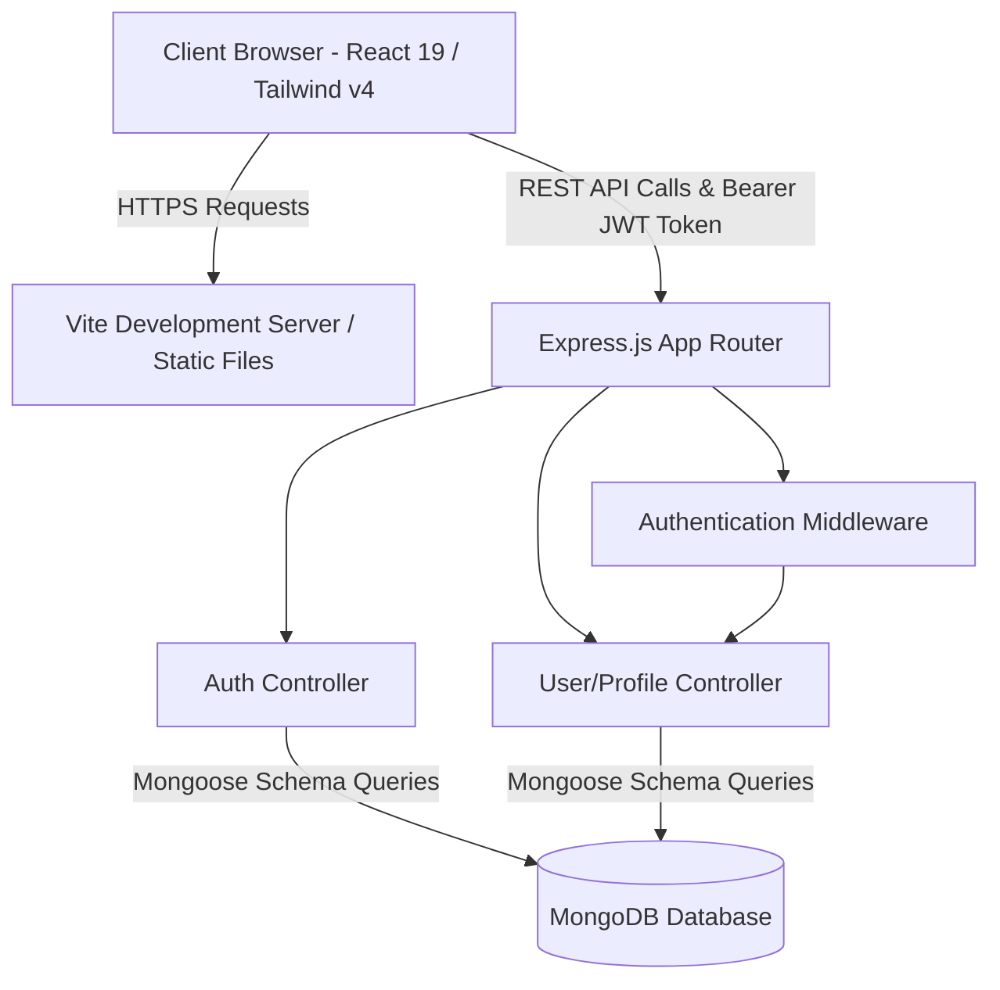

# Student Skills & Projects Hub 🎓💼

[](https://react.dev/)
[](https://tailwindcss.com/)
[](https://expressjs.com/)
[](https://mongoosejs.com/)
[](https://jwt.io/)
[](https://opensource.org/licenses/MIT)

A modern, responsive, and secure web application designed for academic communities. The **Student Skills & Projects Hub** enables students and faculty to manage digital portfolios, showcase project work, update their skill sets, and discover collaborators within the institution. 

This platform serves as a central hub for student innovation, helping bridge the gap between academic study, project development, and professional networking.

---

## 🌟 Features

*   **🔒 Secure Authentication:** JWT-based user authentication featuring cryptographically hashed passwords (`bcryptjs`) and role-based access control (Student vs. Faculty).
*   **📊 Dynamic User Dashboard:** A clean, metrics-driven overview of the user's current role, total skills count, and projects listed.
*   **💼 Profile & Portfolio Management:** Interactive UI allowing students to:
    *   Add and remove skill tags in real time.
    *   Detail project entries with titles, descriptions, and technology info.
*   **🔍 Talent Discovery Engine:** A regex-powered, real-time search interface enabling students and faculty to find peers and potential collaborators by specific skills.
*   **📱 Responsive & Modern UI:** A fully responsive web interface designed with React 19, Vite, and Tailwind CSS v4, utilizing custom typography, micro-interactions, flex/grid layouts, and elegant card-based design systems.

---

## 🛠️ Tech Stack

### Frontend
*   **Framework:** React 19 (Vite environment)
*   **Routing:** React Router v7
*   **Styling:** Tailwind CSS v4
*   **Icons:** Lucide React
*   **API Client:** Axios (configured with automated JWT authorization headers)

### Backend
*   **Runtime Environment:** Node.js
*   **Framework:** Express.js (v5)
*   **Security:** JSON Web Tokens (JWT), Bcrypt.js (Password encryption)
*   **CORS Management:** CORS package for origin control

### Database
*   **Database:** MongoDB
*   **ODM:** Mongoose

---

## 📐 System Architecture



---

## 📂 Folder Structure

```text
student-hub/
├── backend/
│   ├── config/
│   │   └── db.js                 # MongoDB connection logic
│   ├── controllers/
│   │   ├── authController.js     # User signup and login controller
│   │   └── userController.js     # Profile, skills, project, search logic
│   ├── middleware/
│   │   └── authMiddleware.js     # JWT validation middleware
│   ├── models/
│   │   └── user.js               # Mongoose schema for User
│   ├── routes/
│   │   ├── authRoutes.js         # Endpoint mapping for authentication
│   │   └── userRoutes.js         # Endpoint mapping for user profiles & search
│   ├── utils/
│   │   └── generateToken.js      # Helper to sign JWTs
│   ├── .env                      # Backend local environment configuration
│   ├── server.js                 # Main server entrypoint
│   └── package.json              # Backend dependencies and scripts
│
├── frontend/
│   ├── public/                   # Static assets
│   ├── src/
│   │   ├── components/           # Reusable UI components (Button, Card, Input, Navbar)
│   │   ├── context/              # AuthContext for global session state
│   │   ├── pages/                # Views (Home, Login, Register, Dashboard, Profile, Search)
│   │   ├── services/             # Axios instance setup
│   │   ├── App.jsx               # Application routing and layout root
│   │   ├── index.css             # Main stylesheet (Tailwind configuration)
│   │   └── main.jsx              # React initialization
│   ├── .env                      # Frontend environment config
│   ├── tailwind.config.js        # Tailwind config
│   ├── vite.config.js            # Vite configurations
│   └── package.json              # Frontend dependencies and scripts
│
└── README.md                     # Root README documentation
```

---

## 🗄️ Database Design

The application utilizes MongoDB to store user profiles. Below is the Mongoose schema design for the `User` collection:

| Field | Type | Description | Requirements |
| :--- | :--- | :--- | :--- |
| `name` | String | Full name of the user | Required |
| `email` | String | User email address | Required, Unique |
| `password`| String | Cryptographically hashed password | Required |
| `role` | String | Account type (`student` or `faculty`) | Required, Enum |
| `skills` | Array [String] | List of technical and soft skills | Optional |
| `projects`| Array [Object] | Portfolio projects containing `title` and `description` | Optional |

---

## 🔌 API Documentation

All routes are prefixed with `/api`.

### 🔑 Authentication Endpoints
*   `POST /auth/register`
    *   **Body Parameters:** `{ name, email, password, role }`
    *   **Response:** User details and JSON Web Token (JWT)
*   `POST /auth/login`
    *   **Body Parameters:** `{ email, password }`
    *   **Response:** User details and JSON Web Token (JWT)

### 👤 Profile & Search Endpoints (Requires Authorization Header)
*   `GET /users/profile`
    *   **Headers:** `Authorization: Bearer <JWT_TOKEN>`
    *   **Response:** Complete authenticated user profile details
*   `POST /users/skills`
    *   **Headers:** `Authorization: Bearer <JWT_TOKEN>`
    *   **Body Parameters:** `{ skills: ["Skill A", "Skill B", ...] }`
    *   **Response:** Updated array of skills
*   `POST /users/projects`
    *   **Headers:** `Authorization: Bearer <JWT_TOKEN>`
    *   **Body Parameters:** `{ title, description }`
    *   **Response:** Updated array of projects
*   `GET /users/search`
    *   **Headers:** `Authorization: Bearer <JWT_TOKEN>`
    *   **Query Parameters:** `?skill=React`
    *   **Response:** Array of student profiles matching the queried skill (Regex, case-insensitive)

---

## ⚙️ Installation & Setup Instructions

Ensure you have [Node.js](https://nodejs.org/) (v16+ recommended) and a [MongoDB](https://www.mongodb.com/) database running locally or hosted on MongoDB Atlas.

### 1. Setup Backend
1.  Navigate to the backend directory:
    ```bash
    cd backend
    ```
2.  Install the required dependencies:
    ```bash
    npm install
    ```
3.  Create a `.env` file in the `backend/` directory:
    ```env
    PORT=5000
    MONGO_URI=mongodb://localhost:27017/student-hub
    JWT_SECRET=your_jwt_secret_key_here
    ```
4.  Start the backend development server:
    ```bash
    npm run dev
    ```
    *The backend server will run at `http://localhost:5000`.*

### 2. Setup Frontend
1.  Navigate to the frontend directory:
    ```bash
    cd ../frontend
    ```
2.  Install the required dependencies:
    ```bash
    npm install
    ```
3.  Create a `.env` file in the `frontend/` directory:
    ```env
    VITE_API_BASE_URL=http://localhost:5000/api
    ```
4.  Start the frontend Vite server:
    ```bash
    npm run dev
    ```
    *The web application will open automatically or run at `http://localhost:5173`.*

---

## 📸 Screenshots

| 🏠 Landing / Home Page | 📊 User Dashboard |
| :---: | :---: |
| *[Screenshot Placeholder: Landing Page]* | *[Screenshot Placeholder: Dashboard Page]* |

| 👤 Profile Management | 🔍 Search & Explore Peers |
| :---: | :---: |
| *[Screenshot Placeholder: Profile Page]* | *[Screenshot Placeholder: Explore Page]* |

---

## 🚀 Future Enhancements

*   **💬 Messaging System:** Real-time chat allowing students to direct-message prospective collaborators directly through the app.
*   **💼 Opportunity Board:** A job/internship posting page for faculty members to share opportunities and students to apply.
*   **🌟 Project Endorsements:** Ability for faculty to endorse student projects, adding credibility and academic weight to portfolios.
*   **📎 GitHub Integration:** OAuth integration to fetch repository details and display live commit histories directly on project cards.

---

## 🤝 Contributors

*   **Krishna Rathod** - *Initial Work & Architecture*

---

## 📄 License

This project is licensed under the MIT License - see the [LICENSE](LICENSE) file for details.
